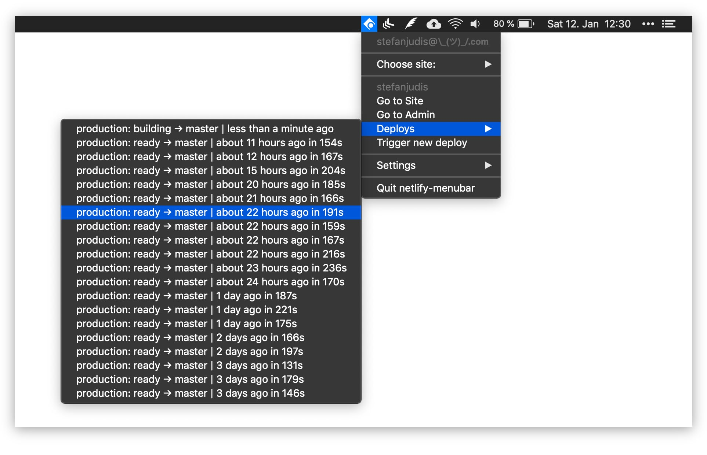

# Netlify Menubar

> See, monitor and controls builds from within your top menubar

## Features

- monitor deploys of a certain site
- poll new deploy information
- get notified when a new deploy is ready

## Contributors

Thanks goes to these wonderful people ([emoji key](https://github.com/all-contributors/all-contributors#emoji-key)):

<!-- ALL-CONTRIBUTORS-LIST:START - Do not remove or modify this section -->
<!-- prettier-ignore -->
| [ <b>Johnny Bell</b>](http://johnnybell.io) [💻](https://github.com/stefanjudis/netlify-menubar/commits?author=johnnyxbell "Code") |
| :---: |
<!-- ALL-CONTRIBUTORS-LIST:END -->

This project follows the [all-contributors](https://github.com/all-contributors/all-contributors) specification. Contributions of any kind welcome!
